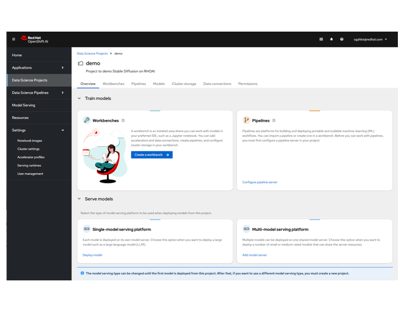
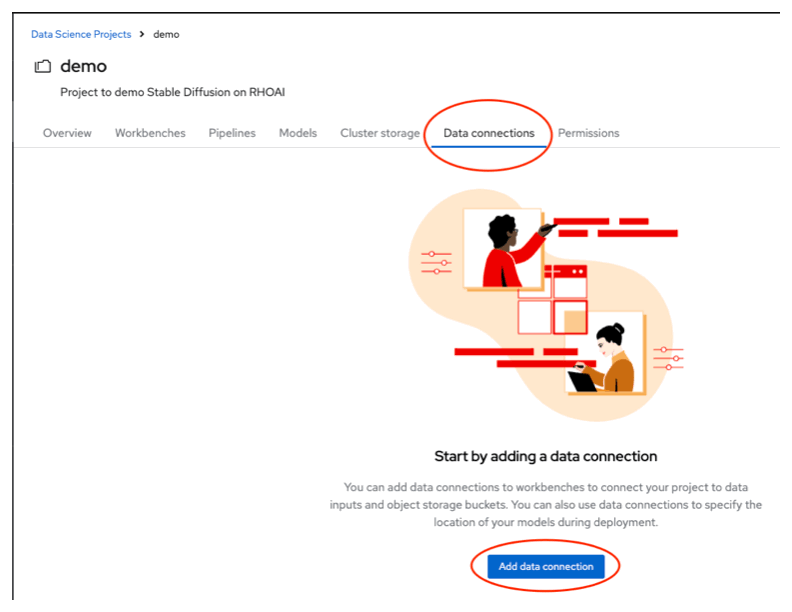
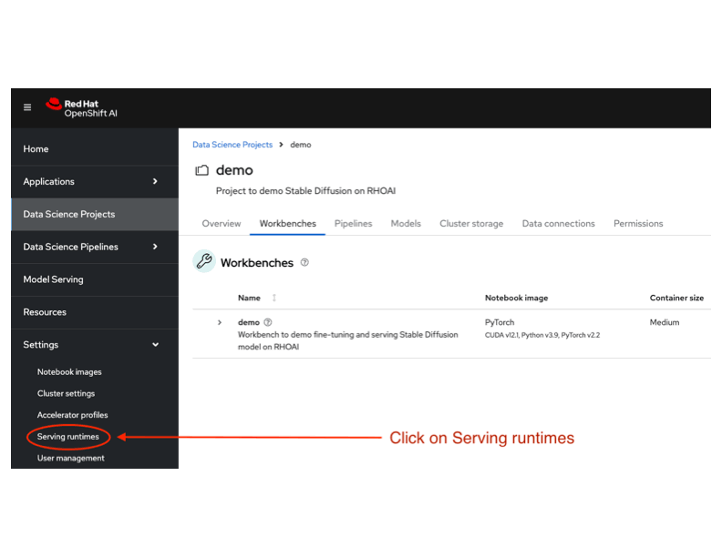
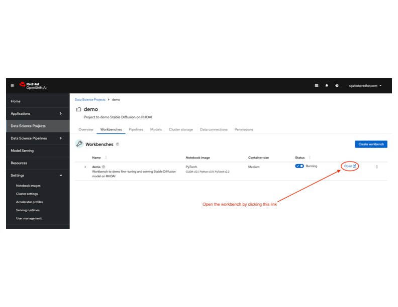

# Stable Diffusion XL in Red Hat OpenShift AI

This readme shows how to serve a [Stable Diffusion XL model](https://huggingface.co/stabilityai/stable-diffusion-xl-base-1.0) in [Red Hat OpenShift AI (RHOAI)](https://www.redhat.com/en/technologies/cloud-computing/openshift/openshift-ai) along with the steps to fine-tune the model.

This project takes the latest SDXL model and familiarizes it with Toy Jensen via finetuning on a few pictures, thereby teaching it to generate new images which include him when it didn't recognize him previously.

Once the model is fine-tuned we will show the steps to deploy the model in RHOAI as well as to access the deployed model to generate the image.


## Prerequisites

Before you can fine-tune and serve a model in Red Hat OpenShift AI, you will need to install RHOAI and enable NVIDIA GPU by following these links:
* [Red Hat OpenShift AI installation](https://docs.redhat.com/en/documentation/red_hat_openshift_ai_self-managed/2.13/html-single/installing_and_uninstalling_openshift_ai_self-managed/index#installing-and-deploying-openshift-ai_install)
* [Enable NVIDIA GPU](https://docs.redhat.com/en/documentation/red_hat_openshift_ai_self-managed/2.13/html/installing_and_uninstalling_openshift_ai_self-managed/enabling-nvidia-gpus_install#enabling-nvidia-gpus_install)

This project generates [LoRA](https://huggingface.co/papers/2106.09685) (_Low-Rank Adaptation of Large Language Models_) weights when the base model is fine-tuned. These weights can be uploaded to one of the following:

1. `MinIO`
   * _Install the `oc` client if using MinIO for model storage_
2. `AWS S3`
   * Setup IAM user/credentials/permissions to create the bucket as well as to upload the objects when using this appraoch


## Quickstart

Open up `Red Hat OpenShift AI` by selecting it from OpenShift Application Launcher. This will open up Red Hat OpenShift AI in a new tab.


### Create Data Science project
Select Data Science Projects in the left navigation menu.

Create a new Data Science project by clicking on `Create data science project` button.
Provide the `Name` as well as the `Resource name` for the project, and click on `Create` button. This will create a new data science project for you.

Select your newly created project by clicking on it.

Below is a gif showing `Create data science project` dialogs:


### Setup LoRA upload approach
The LoRA weights that are generated while fine-tuning the base image need to be uploaded to either AWS S3 or MinIO so that they are available to the model when the model is deployed.


#### Setup MinIO
To setup MinIO, for storing the LoRA weights, execute the following commands in a terminal/console:
```
# Login to OpenShift (if not already logged in)
oc login --token=<OCP_TOKEN>

# Install MinIO
MINIO_USER=<USERNAME> \
   MINIO_PASSWORD="<PASSWORD>" \
   envsubst < minio-setup.yml | \
   oc apply -f - -n <PROJECT_CREATED_IN_PREVIOUS_STEP>
```
* _Set `<USERNAME>` and `<PASSWORD>` to some valid values, in the above command, before executing it_

Once MinIO is setup, you can access it within your project. The yaml that was applied above creates these two routes:
* `minio-ui` - for accessing the MinIO UI
* `minio-api` - for API access to MinIO
  * Take note of the `minio-api` route location as that will be needed in next section.


#### Setup AWS S3
To setup AWS S3, for storing the LoRA weights, setup the following:
* Create IAM user
* Add following permissions to the user, with the `Effect: "Allow"`:
  * `s3:ListBucket`
  * `s3:*Object`
  * `s3:ListAllMyBuckets`
  * `s3:CreateBucket`
    * **This permission is ONLY needed if the bucket is not already created**
* For the above permissions, set `Resource` to:
  * `arn:aws:s3:::*`
  * _If an already existing bucket is used, then the `Resource` can be set to the specific bucket, e.g._
    * `arn:aws:s3:::<EXISTING_BUCKET_NAME>`


### Create workbench
To use RHOAI for this project, you need to create a workbench first. In the newly created data science project, create a new Workbench by clicking `Create workbench` button in the `Workbenches` tab.

When creating the workbench, add the following environment variables:
* AWS_ACCESS_KEY_ID
  * MinIO user name if using `MinIO` else use `AWS` credentials
* AWS_SECRET_ACCESS_KEY
  * MinIO password if using `MinIO` else use `AWS` credentials
* AWS_S3_ENDPOINT
  * `minio-api` route location if using `MinIO` else use `AWS S3` endpoint
    that is in the format of `https://s3.<REGION>.amazonaws.com`
* AWS_S3_BUCKET
  * This bucket should _either be existing or will be created_ by one of the
    Jupyter notebooks to upload the LoRA weights. **_If using `AWS S3` and the
    bucket does not exist, make sure correct permissions are assigned to the
    IAM user to be able to create the bucket_**
* AWS_DEFAULT_REGION
  * Set it to us-east-1 if using `MinIO` otherwise use the correct `AWS` region

  _The environment variables can be added one by one, or all together by uploading a secret yaml file_

Use the following values for other fields:
* _Notebook image_:
  * Image selection: **PyTorch**
  * Version selection: **2024.1**
* _Deployment size_:
  * Container size: **Medium**
  * Accelerator: **NVIDIA GPU**
  * Number of accelerators: **1**
* _Cluster storage_: **50GB**

Create the workbench with above settings.

Below is a gif showing various sections of `Create Workbench`:



### Create Data connection
Create a new data connection that can be used by the init-container (`storage-initializer`) to fetch the LoRA weights generated in next step when deploying the model.

To create a Data connection, use the following steps:
* Click on `Add data connection` button in the  `Data connections` tab in your newly created project
* Use the following values for this data connection:
  * _Name_: `minio`
  * _Access key_: value specified for `AWS_ACCESS_KEY_ID` field in `Create Workbench` section
  * _Secret key_: value specified for `AWS_SECRET_ACCESS_KEY` field in `Create Workbench` section
  * _Endpoint_: value specified for `AWS_S3_ENDPOINT` field in `Create Workbench` section
  * _Access key_: value specified for `AWS_DEFAULT_REGION` field in `Create Workbench` section
  * _Bucket_: value specified for `AWS_S3_BUCKET` field in `Create Workbench` section
* Create the data connection by clicking on `Add data connection` button

Below is a gif showing the `Add data connection` dialog (_the values shown are for MinIO_):



### Add Serving runtime
You can either build the Serving runtime, from [igm-repo](./igm-repo/) sub-directory by following the instructions provided there, or use the existing yaml for adding the serving runtime for deploying the model generated in this project.

Follow these steps to use the existing yaml:
* Expand `Settings` sidebar menu in RHOAI
* Click on `Serving runtimes` in the expanded sidebar menu
* Click on `Add serving runtime` button
* Use the following values in the `Add serving runtime` page:
  * _Select the model serving platforms this runtime supports_: `Single-model serving platform`
  * _Select the API protocol this runtime supports_: `REST`
  * _YAML_: Drag & drop [Stable_Diffusion-ServingRuntime yaml](./Stable_Diffusion-ServingRuntime.yml) file or paste the contents of this file after selecting `Start from scratch` option
* Click on `Create` button to create this new Serving runtime

_You can read more about Model serving [here](https://docs.redhat.com/en/documentation/red_hat_openshift_ai_self-managed/2-latest/html/serving_models/about-model-serving_about-model-serving)_

Below is a gif showing fields on `Add serving runtime` page:



### Open workbench
Now that the workbench is created and running, follow these steps to setup the project:
* Select your newly created project by clicking on `Data Science Projects` in the sidebar menu
* Click on `Workbenches` tab and open the newly created workbench by clicking on the `Open` link
* The workbench will open up in a new tab
* _When the workbench is opened for the first time, you will be shown an `Authorize Access` page._
  * _Click `Allow selected permissions` button in this page._
* In the workbench, click on `Terminal` icon in the `Launcher` tab.
* Clone this repository in the `Terminal` by running the following command:  
  `git clone https://github.com/sgahlot/workbench-example-sdxl-customization.git`

Below is a gif showing `Open workbench` pages:



### Run Jupyter notebook
_The notebook mentioned in this section is used to take the base model and fine-tune it to generate LoRA weights that are used later on to generate toy-jensen image_

* Once the repository is cloned, select the folder where you cloned the repository (in the sidebar) and navigate to `code/rhoai` directory and open up [FineTuning-SDXL.ipynb](./FineTuning-SDXL.ipynb)
* **If `AWS S3` is used to store the LoRA weights, modify the last cell as shown below:**
  * `XFER_LOCATION = 'MINIO'` - change it to `XFER_LOCATION = 'AWS'`
* Run this notebook by selecting `Run` -> `Run All Cells` menu item
* _When the notebook successfully runs, your fine-tuned model should have been uploaded to AWS or MinIO in the bucket specified for `AWS_S3_BUCKET` in `Create Workbench` section_.


### Deploy model
Once the initial notebook has run successfully and the data connection is created, you can deploy the model by following these steps:
* In the RHOAI tab, select `Models` tab (_for your newly created project_) and click on `Deploy model` button 
* Fill in the following fields as described below:
  * _Model name_: **<PROVIDE_a_name_for_the_model>**
  * _Serving runtime_: **Stable Diffusion**
  * _Model framework_: **sdxl**
  * _Model server size_: **Small**
  * _Accelerator_: **NVIDIA GPU**
  * _Model location_: Select **Existing data connection** option
    * _Name_: **Name of data connection created in previous step**
    * _Path_: **model**
* Click on `Deploy` to deploy this model

Copy the `inference endpoint` once the model is deployed successfully (_it will take a few minutes to deploy the model_).


### Generate image
A toy-jensen image can now be generated, using the deployed model. To generate and retrieve the image, use the following steps:
* Open up [GenerateImageUsingModel.ipynb](./GenerateImageUsingModel.ipynb)
* Set the value of `inference_endpoint` variable correctly by pointing it to your model's inference endpoint
  * _Your model `inference endpoint` should have been copied in the previous section_
* Run this notebook by selecting `Run` -> `Run All Cells` menu item
* _When the notebook successfully runs, you should see a toy-jensen image generated in the last cell_.


## System used
* Red Hat OpenShift AI: `2.10.0`
* GPU: 1x NVIDIA `A10G`
* Storage: 50GB


## Python module versions
Even though the latest version is used for all the modules that are installed for this project, here are the versions that are used underneath (in case any version incompatibility occurs in future):

* accelerate: `1.0.1`
* boto3: `1.34.111`
* botocore: `1.34.111`
* dataclass_wizard: `0.23.0`
* diffusers: `0.31.0.dev0`
* ipywidgets: `8.1.2`
* jupyterlab: `3.6.7`
* huggingface_hub: `0.25.2`
* minio: `7.2.7`
* peft: `0.13.2`
* transformers: `4.45.2`
* torch: `2.2.2+cu121`
* torchvision: `0.17.2+cu121`


## Notebooks with output
The following notebooks contain output to give you an idea on how the outputs will look when the notebooks are run:
* [FineTuning-SDXL-01](./more_notebooks/FineTuning-SDXL-with_output-01.ipynb)
* [FineTuning-SDXL-02](./more_notebooks/FineTuning-SDXL-with_output-02.ipynb)
* [GenerateImageUsingModel-01](./more_notebooks/GenerateImageUsingModel-with_output-01.ipynb)
* [GenerateImageUsingModel-02](./more_notebooks/GenerateImageUsingModel-with_output-02.ipynb)


## Links
* [Red Hat OpenShift AI installation](https://docs.redhat.com/en/documentation/red_hat_openshift_ai_self-managed/2.13/html-single/installing_and_uninstalling_openshift_ai_self-managed/index#installing-and-deploying-openshift-ai_install)
* [About Model serving](https://docs.redhat.com/en/documentation/red_hat_openshift_ai_self-managed/2-latest/html/serving_models/about-model-serving_about-model-serving)
* [Enable NVIDIA GPU](https://docs.redhat.com/en/documentation/red_hat_openshift_ai_self-managed/2.13/html/installing_and_uninstalling_openshift_ai_self-managed/enabling-nvidia-gpus_install#enabling-nvidia-gpus_install)
* [Image Generation Models on OpenShift](https://github.com/rh-aiservices-bu/igm-on-openshift)
* [Stable Diffusion XL model](https://huggingface.co/stabilityai/stable-diffusion-xl-base-1.0)
* [LoRA](https://huggingface.co/papers/2106.09685)
